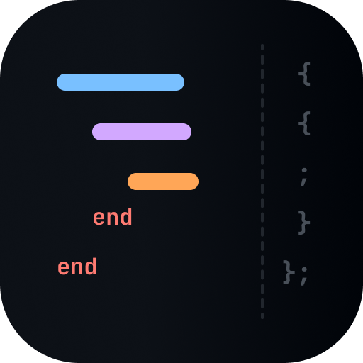

<div align="center">

  

# @indentier/plugin-rust

</div>

[](https://www.npmjs.com/package/@indentier/plugin-rust)
[](https://github.com/indentier/plugin-rust/actions/workflows/ci.yml)
[](./LICENSE)

> Rust support for [Indentier](https://github.com/indentier/indentier).

Full documentation: **[indentier.github.io](https://indentier.github.io)**

## Install

```sh
npm i -D indentier @indentier/plugin-rust
```

## Setup

```jsonc
// .indentierrc.json
{
  "plugins": ["@indentier/plugin-rust"]
}
```

<!-- prettier-ignore -->
| | |
|-|-|
| Language | Rust |
| Extensions | `.rs` |
| Ruby mode | Yes — injects `const end:()=();`; end statement: `end` |

## License

[MIT](./LICENSE) © otoneko.
